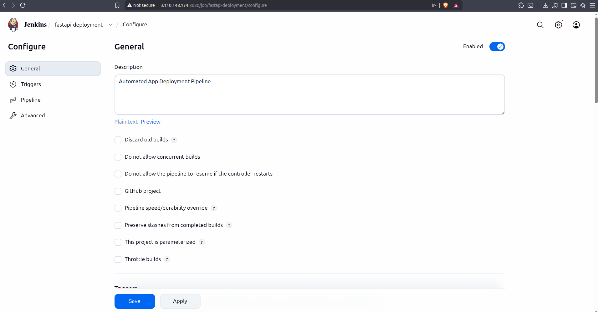
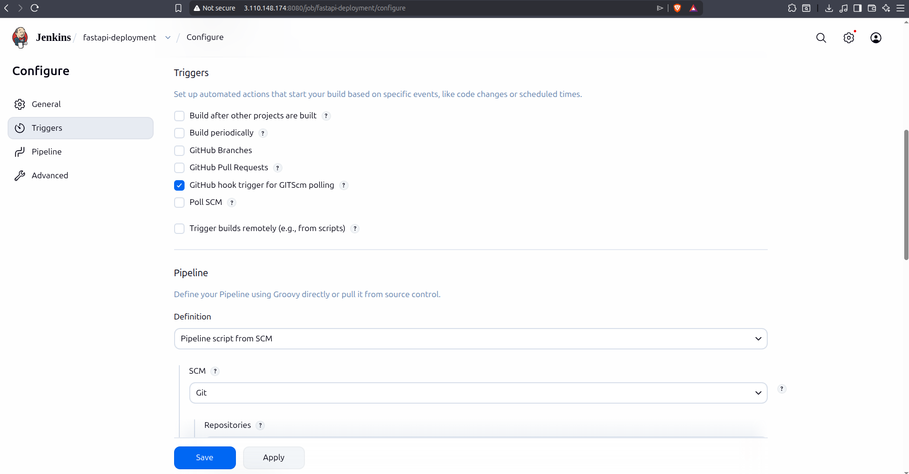
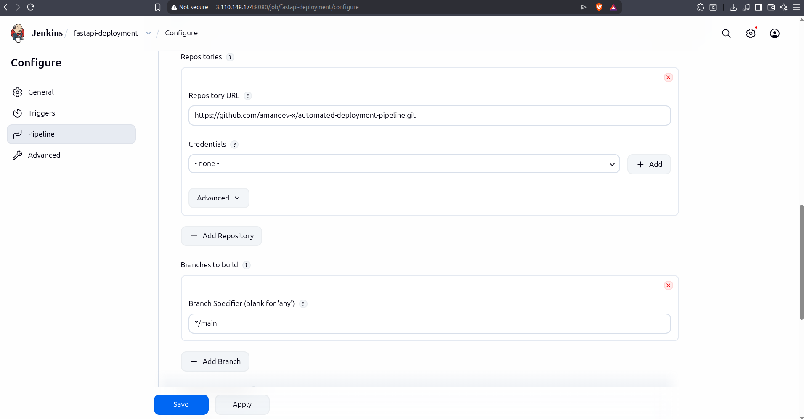
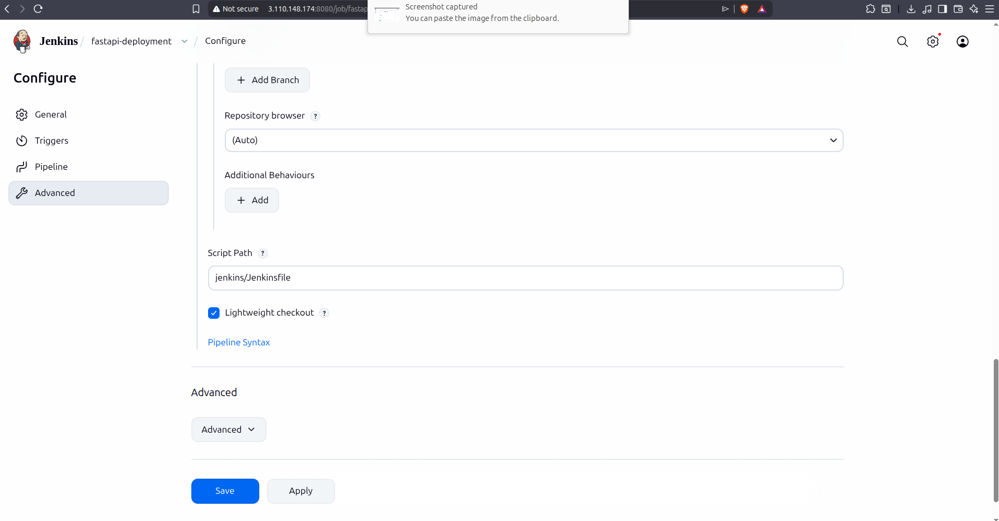
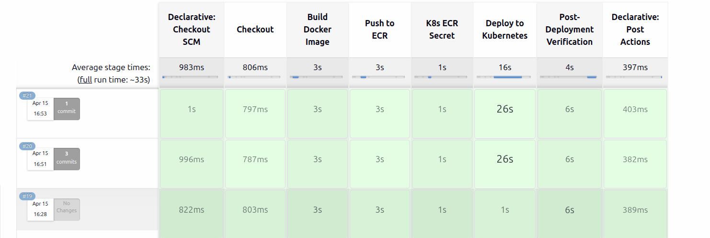
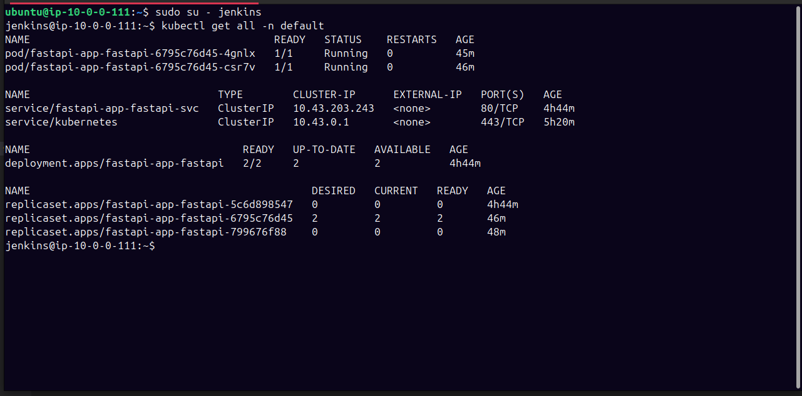

# Automated App Deployment Pipeline


A production-style CI/CD pipeline that provisions infrastructure, configures servers, builds a Docker image, pushes to Amazon ECR, and deploys to a Kubernetes cluster using Helm — fully automated from a single `git push`.
 
---
 
## Architecture


---
 
## Stack
 
| Layer | Tool | Purpose |
|---|---|---|
| Infrastructure | Terraform | Provisions EC2 instances, security groups, IAM roles |
| Configuration | Ansible | Installs Jenkins, Docker, kubectl, Helm on EC2 |
| CI/CD | Jenkins | Runs the automated pipeline on every push |
| Containerization | Docker | Builds and tags the application image |
| Registry | Amazon ECR | Stores Docker images — private, AWS-native |
| Orchestration | Kubernetes (k3s) | Runs the application in pods |
| Deployment | Helm | Parameterized, upgradeable K8s deployments |
| Application | FastAPI | The service being deployed |
 
---
 
## Project Structure
 
```
automated-deployment-pipeline/
│
├── app/                          # FastAPI application
│   ├── main.py
│   ├── requirements.txt
│   └── Dockerfile
│
├── terraform/                    # AWS infrastructure
│   ├── main.tf                   # EC2, security groups, IAM
│   ├── variables.tf
│   ├── outputs.tf
│   └── terraform.tfvars          # gitignored — your values go here
│
├── ansible/                      # Server configuration
│   ├── inventory.ini             # EC2 IPs after terraform apply
│   ├── playbook.yml
│   └── roles/
│       ├── jenkins/              # Installs Jenkins + AWS CLI
│       ├── docker/               # Installs Docker
│       └── k3s/                  # Installs k3s + copies kubeconfig
│
├── helm/                         # Kubernetes deployment chart
│   └── fastapi-app/
│       ├── Chart.yaml
│       ├── values.yaml
│       └── templates/
│           ├── deployment.yaml
│           └── service.yaml
│
├── jenkins/
│   └── Jenkinsfile               # Pipeline definition (pipeline as code)
│
└── README.md
```
 
---
 
## Pipeline Stages
 
```
Checkout → Build Image → Push to ECR → K8s ECR Secret → Deploy → Verify
```
 
| Stage | What Happens |
|---|---|
| Checkout | Jenkins pulls latest code from GitHub |
| Build Docker Image | Builds image tagged with git commit SHA |
| Push to ECR | Authenticates via IAM role, pushes to Amazon ECR |
| K8s ECR Secret | Creates/refreshes `ecr-pull-secret` in Kubernetes |
| Deploy to Kubernetes | `helm upgrade --install` with the new image tag |
| Post-Deployment Verification | Port-forwards service, curls `/health`, asserts HTTP 200 |
 
Every deployment is **immutable and traceable** — the image tag is always the git commit SHA, so any running pod can be traced back to the exact commit that produced it.
 
---
 
## Prerequisites
 
- AWS account with CLI configured locally
- Terraform >= 1.0
- Ansible >= 2.12
- An EC2 key pair created in AWS Console (`jenkins-key`)
- A GitHub repository with this code
---
 
## Setup & Deployment
 
### 1. Provision Infrastructure
 
```bash
cd terraform
 
# Copy and fill in your values
cp terraform.tfvars.example terraform.tfvars
 
terraform init
terraform plan
terraform apply
```
 
Outputs after apply:
```
jenkins_public_ip = "x.x.x.x"
jenkins_url       = "http://x.x.x.x:8080"
k3s_public_ip     = "y.y.y.y"
```
 
### 2. Configure Servers
 
```bash
cd ansible
 
# Fill in the two IPs from terraform output
vim inventory.ini
 
ansible-playbook -i inventory.ini playbook.yml
```
 
This installs Jenkins, Docker, kubectl, Helm on the Jenkins EC2 and k3s on the k3s EC2. It also copies the kubeconfig from the k3s node to Jenkins automatically.
 
### 3. Create ECR Repository
 
```bash
aws ecr create-repository \
  --repository-name fastapi-app \
  --region ap-south-1
```
 
### 4. Configure Jenkins
 
- Open `http://<jenkins-ip>:8080`
- Unlock with: `sudo cat /var/lib/jenkins/secrets/initialAdminPassword`
- Install suggested plugins
- Create a new Pipeline job → SCM: Git → your repo URL
- Script Path: `jenkins/Jenkinsfile`






### Note: When setting up the GitHub Webhook, ensure the Payload URL ends with a trailing slash: http://<jenkins-ip>:8080/github-webhook/. Without it, GitHub may receive a 302 redirect and fail to trigger.

### 5. Trigger the Pipeline
 
```bash
git add .
git commit -m "feat: initial deployment"
git push origin main
```
 
Jenkins detects the push and runs the full pipeline automatically.
 
---
 
## Key Design Decisions
 
**IAM roles instead of stored credentials**
Jenkins authenticates with ECR using an IAM role attached to the EC2 instance — no AWS access keys stored anywhere. The k3s node uses a separate read-only ECR role following least privilege.
 
**Git SHA as image tag**
Every Docker image is tagged with the git commit SHA (`abc1234`). This makes every deployment immutable and traceable — you always know exactly which commit is running in production.
 
**Kubernetes pull secret refreshed every run**
Rather than storing a static ECR token that expires after 12 hours, the pipeline generates a fresh token on every run and updates the `ecr-pull-secret` in Kubernetes. Deployments never fail due to an expired token.
 
**Pipeline as code**
The entire pipeline is defined in `jenkins/Jenkinsfile` committed to the repository — not configured through the Jenkins UI. This means the pipeline is version controlled, reviewable, and reproducible.
 
**Separated Jenkins and k3s nodes**
Jenkins (CI server) and k3s (deployment target) run on separate EC2 instances. This mirrors real production architecture where the build system and the runtime environment are always separate.
 
**Helm for parameterized deployments**
Raw Kubernetes YAML is static. Helm templates allow Jenkins to inject the image tag, environment, and version at deploy time with `--set` flags — the same chart handles every deployment without manual YAML edits.
 
---
 
## Verify the Deployment
 
After a successful pipeline run, verify on the k3s node:
 
```bash
# Check pods are running
kubectl get pods
 
# Check the deployment
kubectl get deployment fastapi-app-fastapi
 
# Hit the health endpoint
kubectl port-forward svc/fastapi-app-fastapi-svc 8080:80
curl http://localhost:8080/health
# {"status":"healthy","version":"abc1234","environment":"production"}
```
 
---
 
## Infrastructure Teardown
 
```bash
cd terraform
terraform destroy
```
 
This removes all AWS resources — both EC2 instances, security groups, and IAM roles.

## Screnshots

### Pipeline Success



### Kubernetes Pods



## Author

**Aman Dabral** 

- **Github**: [@amandev-x](https://github.com/amandev-x)

---

## License

This project is licensed under the **MIT License**.

Copyright (c) 2026 Aman Dabral


 